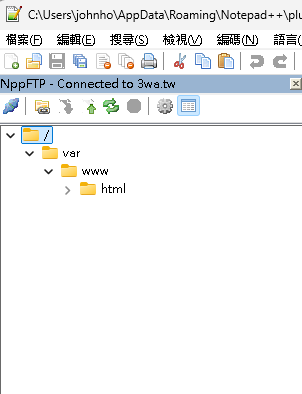
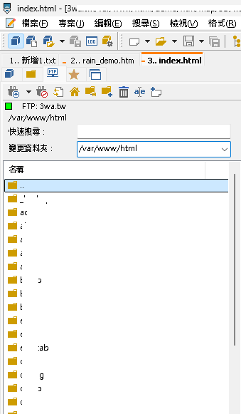
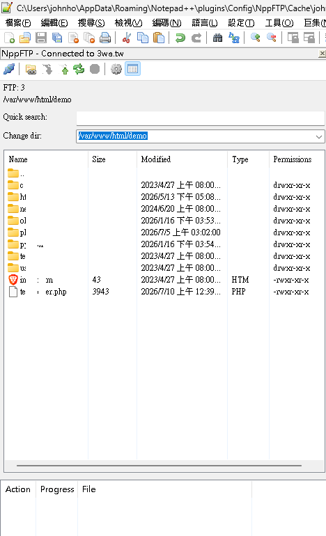

# NppFTP 維護版

NppFTP 是 Notepad++ 的 FTP / FTPS / FTPES / SFTP 外掛。這個維護版目前重點放在三件事：

- 把已知高風險安全問題補起來。
- 整理 Windows 可重現 build 流程。
- 把遠端瀏覽器改成更適合日常工作的 PSPad-like 單層瀏覽模式。

原始專案資訊：

- 官方說明：[NppFTP](http://ashkulz.github.io/NppFTP/)
- 安裝與入門影片：[GitHub issue #305](https://github.com/ashkulz/NppFTP/issues/305)
- 原始建置文件：[BUILDING.md](https://github.com/ashkulz/NppFTP/blob/master/BUILDING.md)

## 為什麼改遠端瀏覽器

舊版 NppFTP 的遠端檔案視圖是樹狀結構。樹很完整，但 FTP 日常工作常見的情境其實是：

- 已經知道目前在 `/var/www/html` 之類的位置。
- 想快速搜尋目前資料夾裡的檔案。
- 想直接輸入路徑跳到常用目錄。
- 不想一次展開很多層目錄，也不想等整棵樹慢慢載。

所以這版改成接近 PSPad FTP 面板的設計：顯示目前位置、快速搜尋、可輸入或下拉的 Change dir，再用單層清單顯示目前目錄內容。

### 舊版樹狀瀏覽



舊版優點是結構清楚，但目錄一多就要一直展開、收合、捲動；如果伺服器目錄很深，操作會變得慢又累。

### PSPad 參考畫面



PSPad 的 FTP 面板比較接近實際工作習慣：上方固定顯示目前路徑，下面只列目前目錄；要跳目錄時直接在 `Change dir` 輸入或從下拉選常用路徑。

### 新版 NppFTP 實作畫面



新版 NppFTP 保留必要資訊，改成目前目錄的單層清單：

- 上方顯示目前 FTP profile 與目前路徑。
- `Quick search` 可即時過濾目前目錄。
- `Change dir` 可以手動輸入路徑並按 Enter 切換；每個 profile 會保存最近 8 筆成功進入的目錄，重複目錄會移到最前方，手打時會顯示符合前綴的下拉建議；尚未載入的路徑會直接向伺服器查詢。
- 清單顯示 `Name`、`Size`、`Modified`、`Type`、`Permissions`；Size 使用靠右的人類可讀格式，Modified 固定為 `yyyy-MM-dd HH:mm:ss`。
- 點欄位標題可排序 `Name`、`Size`、`Modified`、`Type`、`Permissions`：首次為遞增、再次點同欄改為遞減；一次只顯示一個箭頭。`..` 固定在第 0 列，資料夾永遠排在檔案前；Size 依原始 64-bit 值比較，名稱依系統 locale、不分大小寫比較。
- 資料夾與檔案有圖示。
- 欄位標題可拖曳調整順序。
- 點入目錄或開檔時會有 wait cursor 回饋。
- 清單焦點在目錄或檔案時，按 Enter 與 double-click 相同：進入目錄或下載至 cache 後開啟編輯。
- 清單焦點按 Backspace 會先向伺服器 LIST 上層目錄，成功後才切換；root 沒有上層時不動。進入失敗或舊的延遲回應不會覆蓋目前清單、選取或 wait cursor。
- `Change dir` 按 Enter 時，已知目錄會切換，已知檔案會開啟；未載入路徑也會嘗試從伺服器讀取，操作期間顯示 wait cursor。

這樣做不是為了少顯示資訊，而是讓常用操作變短：看目前在哪、搜尋目前資料夾、輸入路徑跳轉、打開檔案，都可以在同一個小面板內完成。

### 遠端清單右鍵選單

在單層遠端清單按右鍵即可直接操作目前選取項目：

| 位置 | 可用操作 |
| --- | --- |
| 檔案 | **Edit**：下載至 cache 並在 Notepad++ 開啟；**Download...**：用 Windows Save As 儲存到指定位置，完成後不開啟 Notepad++；**CHMOD**；重新命名（`F2`）；刪除；建立資料夾／空白檔案（建立在目前目錄）。 |
| 資料夾 | **Download...**：選擇本機父目錄後，在其下建立同名資料夾並遞迴下載；**Upload files...**：可一次選取多個本機檔案上傳；**CHMOD**；重新命名（`F2`）；刪除；建立資料夾／空白檔案（建立在該資料夾）。 |
| 清單空白處 | 重新整理目前目錄、建立資料夾、建立空白檔案、上傳檔案。 |
| `..` | 不顯示會變更遠端資料的右鍵選單。 |

同名上傳時會詢問覆寫、略過或取消，也可在本次連線選擇後續直接覆寫；刪除檔案與資料夾前會再次確認。

本機檔案與目錄也可直接拖入清單：拖到目錄會上傳到該目錄，拖到檔案或空白處會上傳到目前目錄。目錄採遞迴上傳，會先建立父目錄、合併已存在的遠端目錄，再逐檔顯示 queue progress；junction / symlink 等 reparse point 不會被跟隨。

`Download...` 與 `Edit` 是兩條不同流程：`Edit` 僅用於下載到 NppFTP cache 後開啟編輯；`Download...` 一律由使用者決定本機儲存位置。遞迴下載會跳過遠端 symlink，不會沿著連結繼續走訪。

## 這輪維護做了什麼

安全與穩定性：

- 修正 FTPS hostname verification。
- 將 FTPS 憑證例外縮到 host/profile 範圍，不再用全域例外。
- 修正 cache path traversal，限制快取路徑不可逃出 cache root。
- 修正 FTP PASV response parsing overflow。
- FTP PASV data connection 預設連回 control peer，避免被惡意 PASV endpoint 帶走。
- 修正 `CUT_StrMethods::RemoveCRLF` unsigned underflow。
- 修正 SFTP directory listing path composition overflow。
- FTP 上傳 buffer 由 255 bytes 調整為 64 KB，並補上 partial-send 保護，降低大量小型 send 與進度 callback 的負擔。
- 預設 profile password/passphrase 改用 Windows DPAPI 儲存。
- GitHub Actions pin 到 commit SHA，並設定明確 workflow permissions。
- 增加 FTP multiline response 與 directory listing 上限，避免惡意伺服器造成 DoS。

建置與供應鏈：

- 新增 `build.bat` 與 `build_scripts.ps1`，整理目前 Windows x64 Release build 入口。
- `third_party_sources.md` 記錄第三方來源 URL、license、SHA256 與 fallback 策略。
- 目前不把第三方 tarball vendor 進 git；只有在需要離線或上游來源不穩時才自養 mirror。

遠端瀏覽器：

- 保留舊 tree code，先讓新 flat browser 可用再逐步替換。
- 新增目前路徑、快速搜尋、Change dir combo。
- 新增單層目錄清單、資料夾/檔案圖示、metadata 欄位與 header drag/drop。
- 支援 double-click 或 Enter 進目錄與下載開檔。
- Backspace 會以 server LIST 確認上層目錄後再切換；目錄載入失敗或較舊請求晚到時保留現有畫面。
- 支援 typed path：已知目錄切換、已知檔案開啟，未載入目錄會向伺服器查詢後切換。
- FTP / SFTP 檔案大小與傳輸進度保留超過 2 GB 的 64-bit 值；Size 使用 B / KB / MB / GB / TB、兩位小數並靠右；Modified 固定顯示為 `yyyy-MM-dd HH:mm:ss`。
- 支援五欄 view-only 排序；重新整理或 mutation refresh 後仍以目前排序顯示，並依 remote path 找回目標列的 focus。
- 修正 dock resize / splitter resize 後 flat browser 沒跟著重排的問題。

遠端檔案操作：

- 新增檔案、目錄、空白處三組右鍵選單，支援 Edit、CHMOD、F2 rename、delete、refresh、new file / directory 與 multi-file upload。
- 支援拖放檔案與目錄、遞迴目錄上傳、遠端目錄安全合併、同名檔覆寫選擇與逐檔進度。
- SFTP 可區分 permission denied 與 path not found；FTP / FTPS 無法確定原因時保留 generic rejection，避免亂猜。
- 單一操作失敗顯示提示並寫入 Output；遞迴上傳只在完成時顯示一個摘要。
- rename、CHMOD、建立檔案成功並刷新後，會保留目標列的選取、鍵盤 focus 與可見位置。
- `Download...` 單檔使用 Windows Save As；遠端目錄選本機父目錄後建立同名 root 遞迴下載。每個下載批次可選擇覆寫、略過、取消，或套用到剩餘檔案；遠端 symlink 不遞迴。
- 使用者指定的下載完成後只寫入 Output，不會再詢問或開啟 Notepad++；要下載後開啟請使用 **Edit**。

## Build

需求：

- Windows
- PowerShell 7.6+
- Visual Studio C++ tools
- CMake

快速建置：

```bat
build.bat
```

產物：

- Plugin DLL：`_build\Release\NppFTP.dll`
- Zip package：`_build\NppFTP-0.30.22-win64.zip`

`build_scripts.ps1` 會檢查 Visual Studio、CMake、Perl 等環境；OpenSSL / zlib / libssh 仍走既有 third-party build 流程，並保留 hash 驗證。

### 安裝與本機測試

Release 使用者：下載 zip、解壓 `NppFTP.dll`，放到 `Notepad++\plugins\NppFTP\NppFTP.dll`，再重新啟動 Notepad++。

本機開發完成後，可關閉 Notepad++，再以系統管理員身分執行：

```bat
copyNppFTPdllToRealENV.bat
```

腳本會把 `_build\Release\NppFTP.dll` 覆蓋到 `C:\Program Files\Notepad++\plugins\NppFTP\NppFTP.dll`，並以 binary compare 驗證結果。

## 專案紀錄

- `history.md`：重要修正、踩雷、決策、build hash。
- `todo.md`：剩餘工作與不做項目。
- `third_party_sources.md`：第三方套件來源與 checksum。
- `docs/superpowers/plans/`：較大任務的分步計畫。
- `snapshot/`：README 使用的舊版 NppFTP、PSPad 參考、新版 NppFTP 畫面截圖。

## 目前狀態

已完成的主線：

- 安全加固第一輪。
- Windows baseline build。
- PSPad-like flat remote browser、鍵盤操作與 metadata 顯示。
- 右鍵檔案操作、CHMOD、multi-file / recursive directory upload 與失敗提示。
- Windows x64 GitHub Actions build；`v*` tag 會自動建立 GitHub pre-release。
- Windows x64 DLL 已在 Notepad++ 實機載入；FTP 清單正確顯示 `5.00 GB`，確認超過 4 GB 的 64-bit 檔案大小路徑。
- README、第三方來源 ledger 與維護紀錄整理。

目前主線尚未開發：

- UI 語系選擇；預設語系規劃為正體中文。

已開發、仍需要實機手動 QA：

- 測 resize、icons、metadata columns、header drag/drop、double-click / Enter 與 typed path。
- 測右鍵選單、F2、picker / drop target、Skip / Cancel / session overwrite-all。
- 測 rename、CHMOD、new file 成功 refresh 後，目標列仍被選取、取得鍵盤 focus 並捲回可見位置。
- 測 recent dirs 依 profile 分開保存、重啟後仍在、重複目錄會移到最前方，以及 Change dir 手打前綴會展開匹配下拉。
- 測 FTP / FTPS / SFTP 的 permission / missing-path / generic failure 提示。
- 測 FTP / SFTP recursive upload 的新舊目錄合併、nested collision、symlink、逐檔 progress 與單一摘要。
- 測 Backspace 的檔案／資料夾／root、空目錄與 denied/missing 目錄、快速 A→B 導覽，以及 FTP/FTPS 與 SFTP 的五欄排序和右鍵建立目標。

暫不做：vendor 第三方 tarball、加入新 UI library、為了移除舊 tree code 而重寫整個 FTP window。只有離線 build 或上游來源不穩時，才考慮自養第三方 archive mirror。

## Build Status

[](https://github.com/shadowjohn/NppFTP/actions/workflows/CI_build.yml)
[](https://github.com/shadowjohn/NppFTP/releases)
